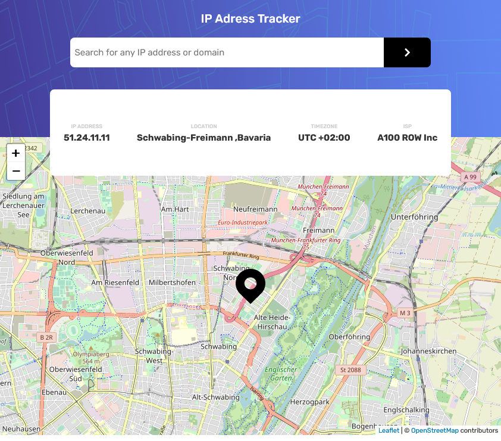

# IP Tracker

A challenge from FrontEndMentor.io's intermediate section to create a web app that shows a location on the inserted IP address in the search field. Created with html, css and vanilla js.

## Screenshots

  
## Demo
For a full view, follow the link bellow

https://goofy-booth-b85dfa.netlify.app/
  
## Authors

- [@Atanas97](https://www.github.com/Atanas97)

  
